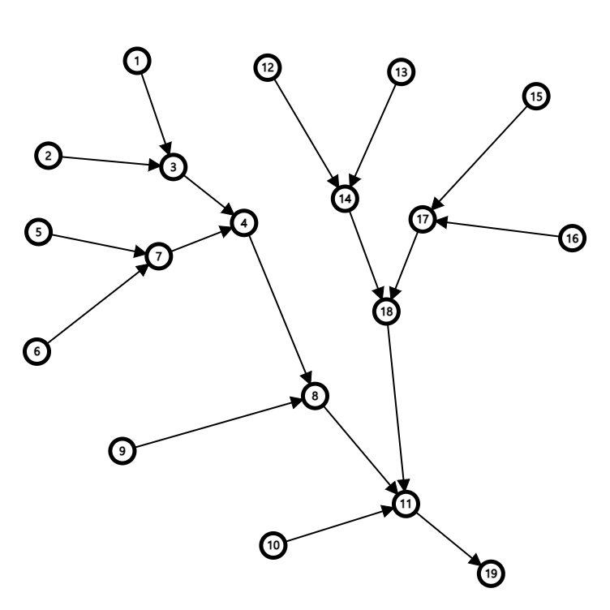
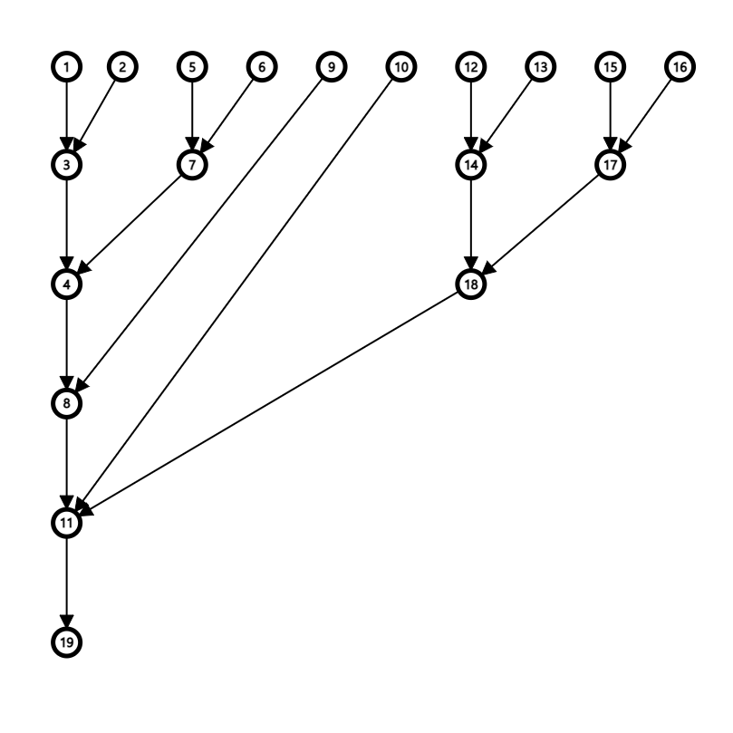

# Strahler number

> Strahler stream order; 하천 규모를 구분하기 위해서 각 천의 합류점을 기준으로 구간에 부여되는 차수

`루트 노트`에서 `단말 노드`까지 유향 그래프로 모델링 할 수 있으며 물이 흐르는 방향이 간선의 방향이다.

- 강의 근원이 되는 노드의 순서는 `1`이다.
- 다른 노드는 그 노드로 들어오는 강의 순서 중 가장 큰 값을 `i`라고 했을 때 노드로 들어오는 노드의 순서들 중에서
  - 순서가 i인 노드가 1개이면 순서는 `i` 이다.
  - 순서가 i인 노드가 2개 이상이면 순서는 `i+1` 이다.


([NAVER 지식백과 : 하천차수](https://terms.naver.com/entry.nhn?docId=3396286&cid=60289&categoryId=60289))


---


All trees in this context are [directed graphs](https://en.wikipedia.org/wiki/Directed_graph), oriented from the root towards the leaves; in other words, they are [arborescences](https://en.wikipedia.org/wiki/Arborescence_(graph_theory)). The [degree](https://en.wikipedia.org/wiki/Degree_(graph_theory)) of a node in a tree is just its number of children. One may assign a Strahler number to all nodes of a tree, in bottom-up order, as follows:

- If the node is a leaf (has no children), its Strahler number is one.
- If the node has one child with Strahler number *i*, and all other children have Strahler numbers less than *i*, then the Strahler number of the node is *i* again.
- If the node has two or more children with Strahler number *i*, and no children with greater number, then the Strahler number of the node is *i* + 1.

The Strahler number of a tree is the number of its root node.


([WIKIPEDIA : Strahler number](https://en.wikipedia.org/wiki/Strahler_number))


---


# Modeling

(strahler stream order image; https://en.wikipedia.org/wiki/Strahler_number)

---


## Directed graph (include vectex, edge)

**[sample input.txt]**

```
19 18 // vertex count, edge count
1 3 // U ---> V
2 3
3 4
5 7
6 7
7 4
4 8
8 11
9 8
10 11
12 14
13 14
14 18
15 17
16 17
17 18
18 11
11 19
```

**[sample output]**

```
Strahler number : 4
```





---




Graph Visualization : https://csacademy.com/app/graph_editor/
